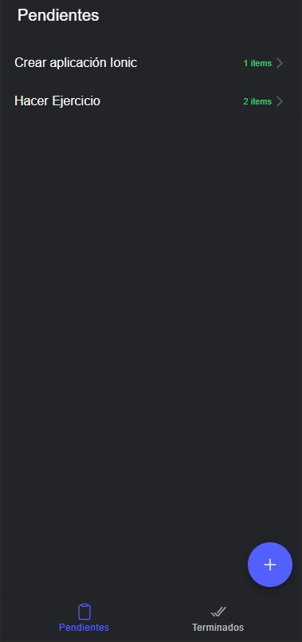

# Deseos APP
Aplicación en IONIC que almacena tareas por medio de LocalStorage

## Pre-requisitos 📋
- Tener instalado Android Studio

## Comenzando 🚀

Una vez clonado el proyecto nos movemos al interior de la carpeta del proyecto para descargar las dependencias necesarias.
```
npm install
```

## Comenzando 🚀

Instalar capacitor para poder importar la aplicacion para android.
```
npm install @capacitor/core @capacitor/cli
```

Construir el proyecto ionic
```
ionic build
```

Instalar la plataforma nativa de android
```
npx cap add android
```

Abrir el proyecto con android studio
```
npx cap open android
```

## Vista previa del proyecto
